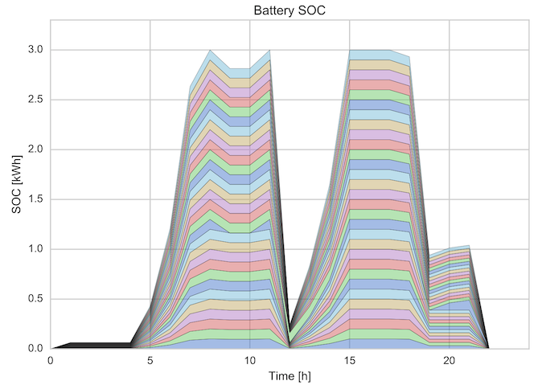

# ipyviz
Collection of Visualization Scripts for Ipython Notebooks

## Plotting Routines

### Line Plot
(coming soon)

### Area Plot

### Maps
See Example Notebook

### Network Graphs
See Example Notebook

## Examples

[IPython Notebook with examples](http://nbviewer.jupyter.org/github/martinzellner/ipyviz/blob/master/examples/ipyviz%20Examples.ipynb#)
